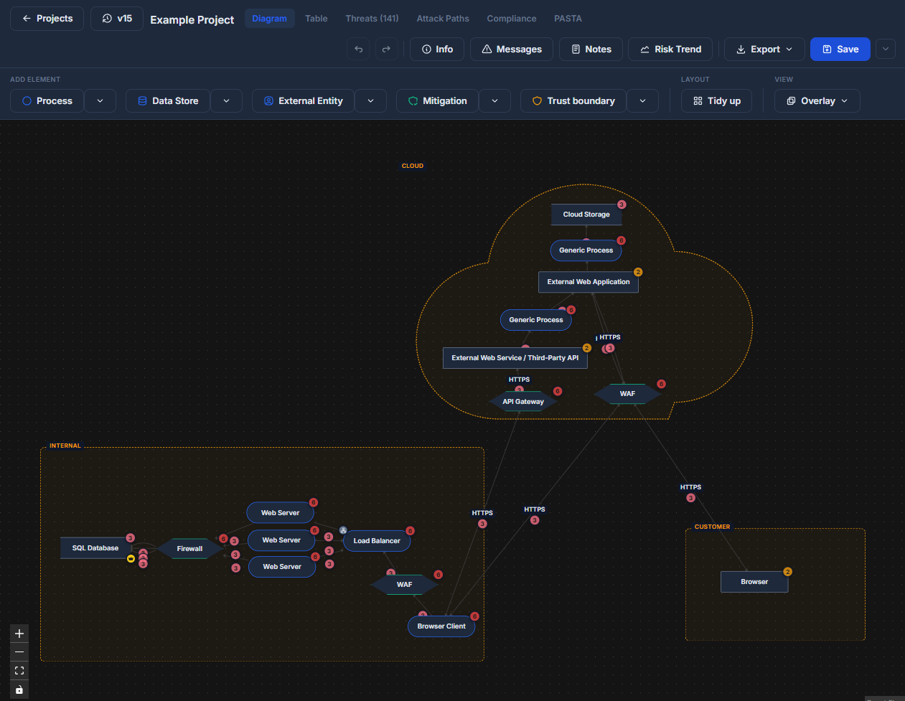
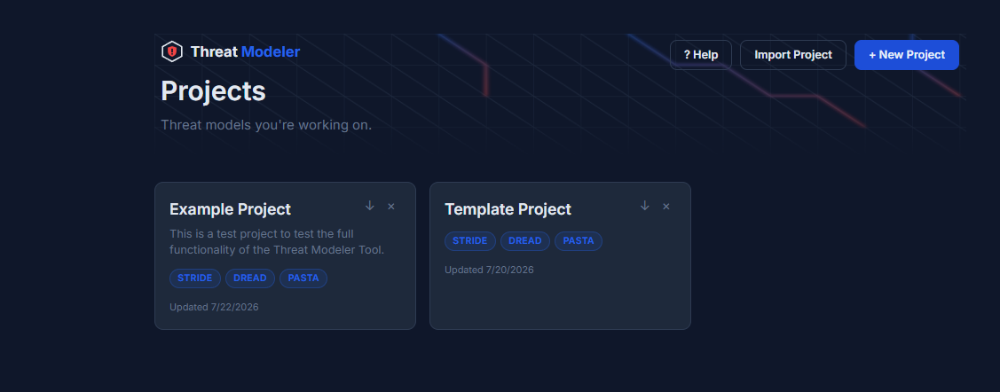
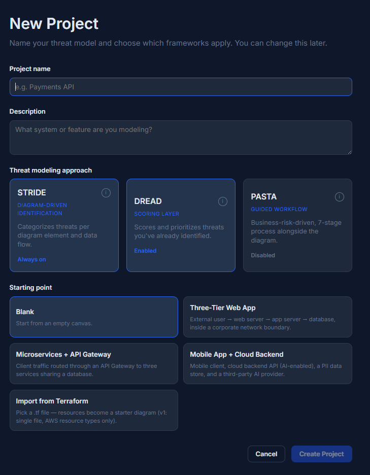
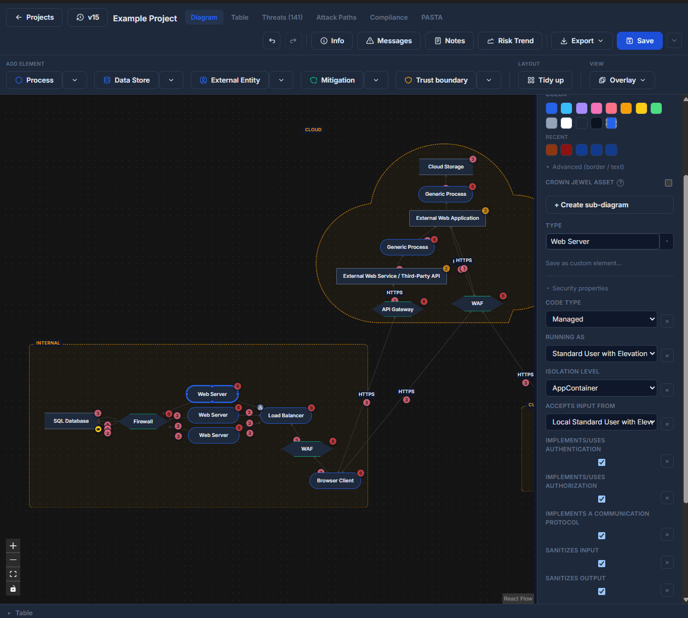
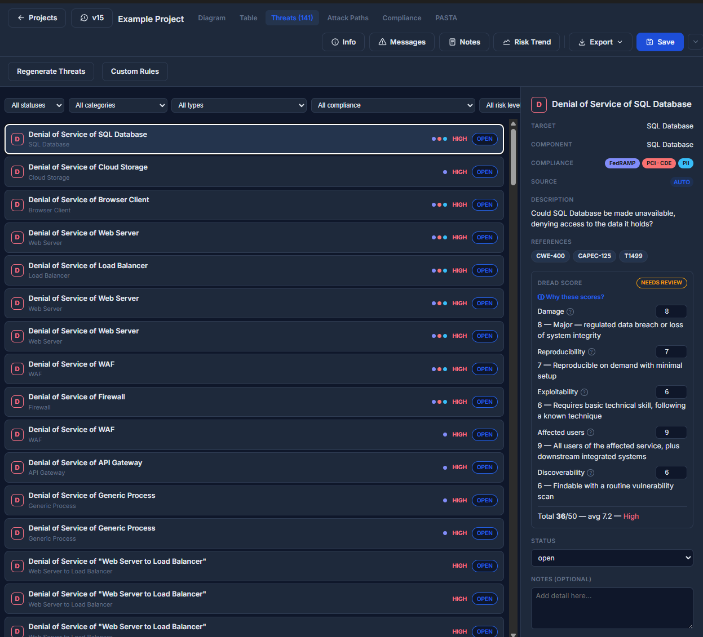
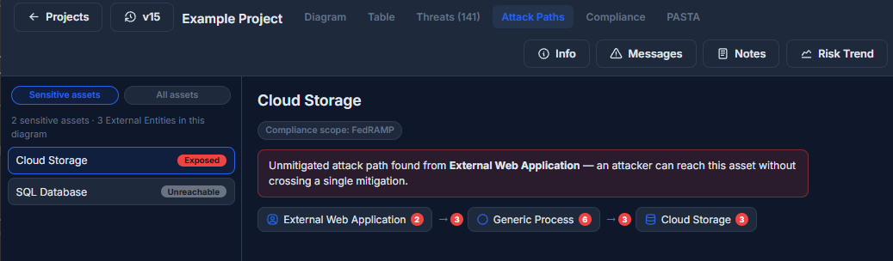
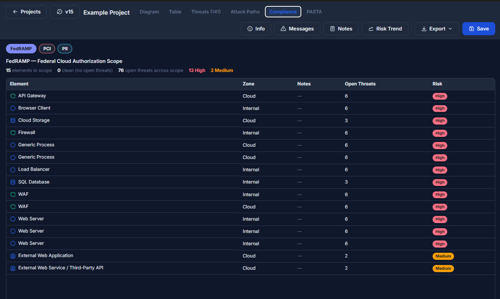
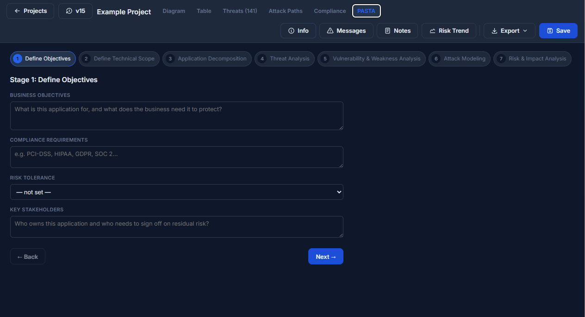
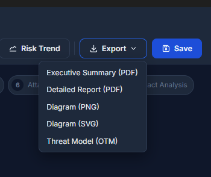

# Threat Modeler


A Windows desktop threat-modeling tool that unifies **STRIDE**, **DREAD**, and
**PASTA** as layered, complementary views of the same threat model instead of
three separate tools bolted together. Draw a data-flow diagram once; STRIDE
threats, DREAD scores, compliance scope, and attack-path analysis all derive
from — and stay connected to — that same diagram.

Inspired by Microsoft's Threat Modeling Tool and OWASP Threat Dragon. Built
as a solo learning/portfolio project — every design decision below was made
and can be second-guessed on its own merits, not because "that's how the
other tools do it."



## Contents

- [Why this exists](#why-this-exists)
- [Features](#features)
- [Screenshots](#screenshots)
- [Getting started](#getting-started)
- [Tech stack](#tech-stack)
- [Project structure](#project-structure)
- [Documentation](#documentation)
- [Status](#status)
- [License](#license)

## Why this exists

Most threat-modeling tooling makes you pick a lane: STRIDE-only diagram
tools, DREAD-only spreadsheets, or PASTA as a standalone document process
with no link back to the architecture that produced it. This project treats
STRIDE (the diagram), DREAD (the scoring), and PASTA (the business-risk
narrative) as three views over one underlying model — a mitigation you add
to the diagram immediately shows up as a DREAD score reduction with a
transparent, per-field explanation of why; a compliance tag on a data store
propagates through the flows it touches and bumps the categories that
actually depend on confidentiality/integrity/audit-trail, not a blanket
score across the board.

## Features

### Diagramming
- Data-flow diagram canvas — processes, data stores, external entities,
  trust boundaries, and mitigation controls (firewall/WAF/IDS-IPS/API
  Gateway), with floating edges that reroute cleanly around any shape
- A Microsoft Threat Modeling Tool–derived security-attribute schema per
  element type, with per-instance custom properties and "save as custom
  element" to grow your own catalog
- Trust-boundary geometry: containment detection, boundary-crossing flow
  flagging, resizable/reshapeable boundaries (rectangle/circle/cloud)
- Sub-diagrams — a Process node can drill into its own nested diagram, to
  arbitrary depth, with independently scoped threats and undo history
- Auto-layout ("Tidy up") and Terraform `.tf` import, both building on the
  same dagre-based layout engine
- Version history — every save is a restorable, full-project snapshot

### STRIDE
- Automatic threat generation per element and per data flow, driven by the
  diagram's structure and each element's declared security attributes
- User-definable custom rules (condition → category + templated
  description), layered on top of the built-in rule set with no conflicts
- CAPEC/CWE and MITRE ATT&CK technique citations per threat category,
  verified against authoritative sources

### DREAD
- Five-field scoring (Damage / Reproducibility / Exploitability / Affected
  Users / Discoverability) with auto-suggested starting scores
- A full "Why these scores?" breakdown — every contributing factor, labeled,
  including negative contributions from mitigations in place
- A scoring rubric with textual anchors for all 50 field/value combinations
- Inherent-vs-residual scoring, so you can see what a mitigation is actually
  buying you, not just the final number
- Weighted control-verification credit (proposed / implemented / verified /
  failed) instead of a binary "mitigated or not"

### PASTA
- Full 7-stage guided workflow (Objectives → Technical Scope → App
  Decomposition → Threat Analysis → Vulnerability Analysis → Attack
  Modeling → Risk/Impact Analysis), auto-pulling live summaries from the
  diagram, generated threats, and DREAD scores where relevant

### Compliance & risk
- Tagging for PII / PHI / PCI / GDPR / SOX / SOC 2 / CMMC / HIPAA /
  ISO 27001 / NIST CSF 2.0 / FedRAMP, with same-trust-zone propagation and
  a PCI-specific Connected/CDE scope model
- A reverse, auditor-facing Compliance view — start from a framework, see
  what's in scope and its open-threat/risk status
- Crown-jewel asset tagging for business-impact prioritization
- Attack-path analysis — from any External Entity, can a sensitive asset be
  reached without crossing a mitigation, and if so, how?
- A risk-trend dashboard charting open threats by DREAD level over time

### Reporting & interop
- PDF export (executive summary and detailed variants), including every
  sub-diagram with its own screenshot and threat table
- CSV export, standalone PNG/SVG diagram export, and SARIF 2.1.0 / OTM 0.2.0
  export for handing off to other tooling
- A sortable risk-register table view and one-click Copy-as-Markdown for
  pushing a threat into any issue tracker

### Project workflow
- Starter project templates (three-tier web app, microservices + API
  gateway, mobile + cloud backend) alongside a blank canvas
- Risk-acceptance sign-off (accepted-by/on, review-by date, overdue
  warnings) and lightweight async reviewer comments per threat
- A native Windows installer via `electron-builder`

## Screenshots

**Dashboard**


**New Project wizard** — pick which frameworks apply, then start blank, from a template, or from a Terraform import


**Security properties** — the MS-TMT–derived attribute schema, live in the Inspector


**DREAD scoring, fully explained** — every score comes with citations and a breakdown of exactly what drove it


**Attack-path analysis** — can an attacker reach this asset, and through what chain?


**Reverse compliance view** — start from a framework, see what's in scope and its risk status


**PASTA workflow** — a guided, 7-stage business-risk process alongside the diagram


**Export** — PDF, CSV, PNG/SVG, and SARIF/OTM for interop with other tooling



## Getting started

**Prerequisites**: Node.js 24+ (LTS), Windows.

```bash
git clone https://github.com/<user>/ThreatModeler.git
cd ThreatModeler/app
npm install
npm run electron:dev
```

To build a standalone Windows installer:

```bash
npm run electron:build
```

Output lands wherever `build.directories.output` in `app/package.json`
points — by default this repo builds outside any cloud-synced folder to
avoid file-lock issues during packaging (see `PROJECT_STATUS.md` if you hit
an `EPERM` error during the build and need to know why).

## Tech stack

| | |
|---|---|
| **App shell** | Electron (main process + preload, plain JS/CJS) |
| **UI** | React 19 + TypeScript, Vite |
| **Diagram canvas** | [`@xyflow/react`](https://reactflow.dev) (React Flow v12) |
| **Auto-layout** | `dagre` |
| **Diagram capture / export** | `html-to-image` |
| **Icons & font** | `@tabler/icons-react`, self-hosted Inter (`@fontsource/inter`) |
| **Packaging** | `electron-builder` (NSIS installer) |
| **Persistence** | Local JSON files (`app.getPath('userData')/projects/*.json`) — no server, no account, no telemetry |

## Project structure

```
ThreatModeling/
├── PROJECT_STATUS.md      # full build history, decisions, and gotchas
├── README.md
└── app/
    ├── electron/          # main process + preload (main.js, preload.cjs)
    └── src/
        ├── pages/         # Dashboard, NewProjectWizard, Canvas
        ├── canvas/        # diagram nodes/edges, Inspector, stencils, layout
        ├── threats/       # STRIDE rule engine, DREAD engine, citations
        ├── attackPath/    # attack-path reachability analysis
        ├── compliance/    # auditor-facing compliance view
        ├── pasta/         # PASTA workflow
        ├── iac/           # Terraform import
        ├── reports/       # PDF/report HTML templates
        ├── templates/     # starter project templates
        └── components/    # shared dialogs (Modal, Getting Started, etc.)
```

## Documentation

[`PROJECT_STATUS.md`](PROJECT_STATUS.md) is the durable build log for this
project — every release, every real bug found and how it was root-caused
(not just patched), every deliberate scope decision and why (including what
was evaluated and *not* built, and why not). It's written as a handoff
document for continuing the work, so it goes deeper than a typical
changelog.

## Status

v0.1.1. All originally planned functionality is built and verified — see
`PROJECT_STATUS.md` for the full release-by-release history. Currently
gathering peer feedback on UI/UX before the next round of incremental
updates.

## License

No license file is currently published in this repository — all rights
reserved by default. Reach out if you'd like to use this code and a license
hasn't been added yet.
